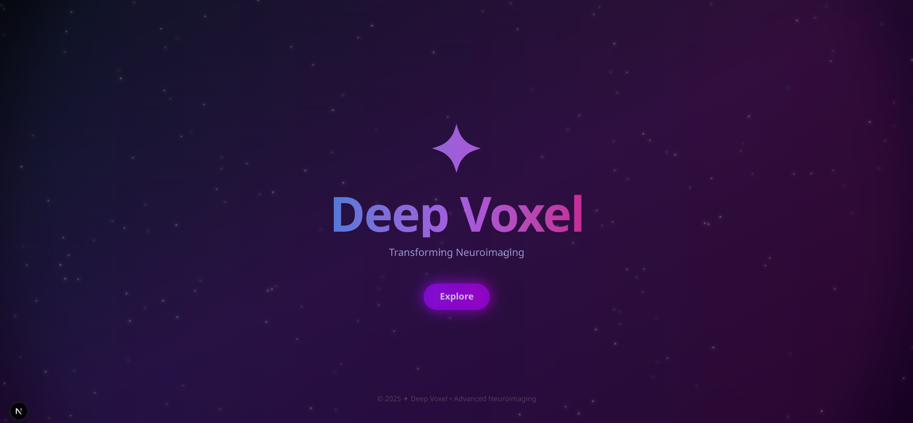
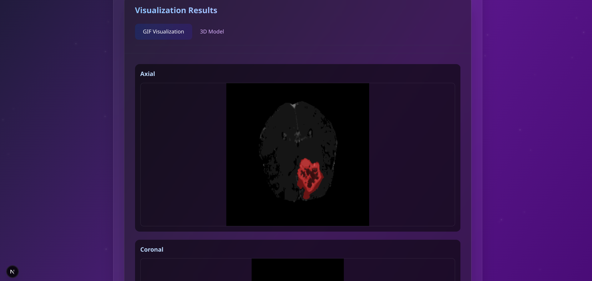
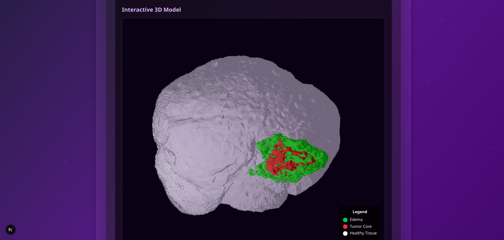
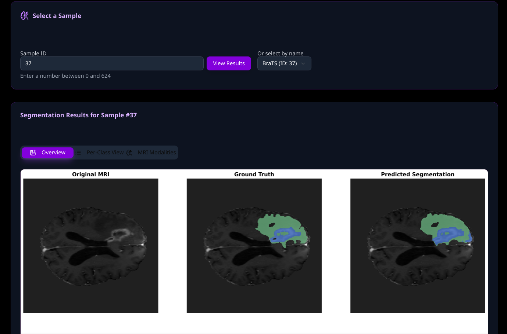
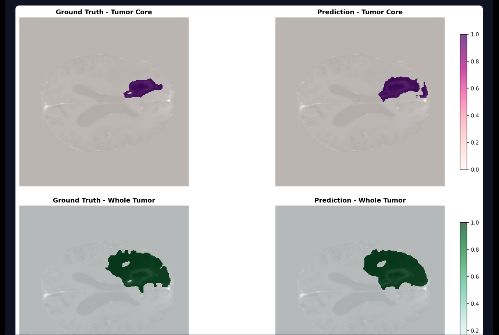
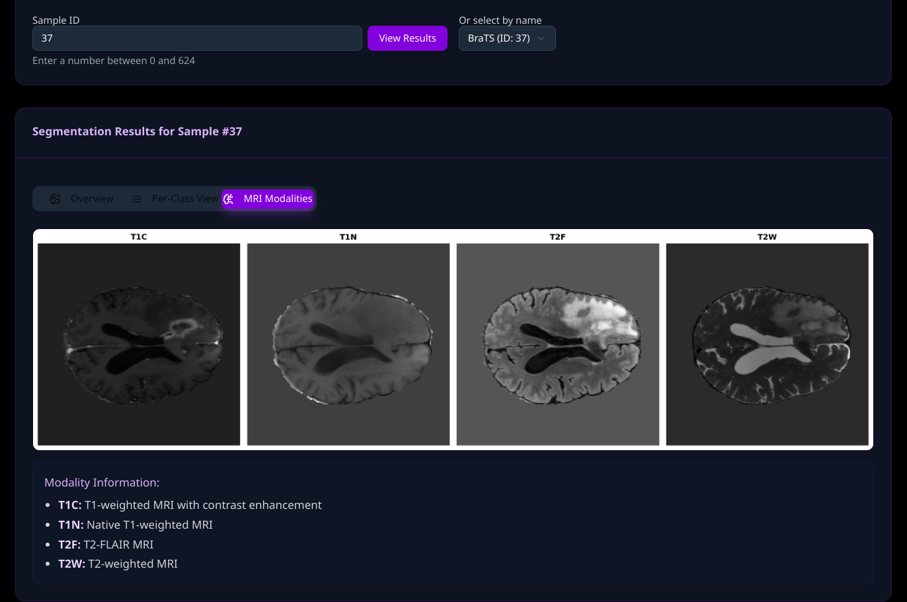

# 🟆 DeepVoxel

A web-based 3D MRI viewer with real-time tumor segmentation powered by a knowledge-distillation optimized SwinUNETR backend.

## Overview

**DeepVoxel** brings AI-assisted brain MRI analysis to the browser with a clean, intuitive 3D viewer and real-time inference powered by a transformer-based segmentation model. Built with React Next.js, Three.js, and Tailwind CSS, this frontend seamlessly communicates with a lightweight, state-of-the-art backend that leverages knowledge-distilled SwinUNETR for accurate, efficient 3D segmentation.

---

### 💡 What is Swin UNETR?

SwinUNETR is a cutting-edge transformer-based architecture for 3D medical image segmentation. It uses SwinTransformers as the encoder and a UNet-style decoder to produce high-resolution segmentation maps.

### Why Distillation?

Vanilla SwinUNETR models, while powerful, are computationally expensive and heavy on memory (often exceeding 100M parameters). To enable **real-time inference in the browser or lightweight hardware environments**, we applied **knowledge distillation**.

- **Teacher**: Full Swin UNETR (62M+ parameters)
- **Student**: Distilled Swin UNETR (~74% parameter reduction)
- **Final model**: ~15M parameters (≈74% smaller)
- **Performance**: Maintains near-identical Dice scores on BraTS 2023 validation set while being **4x faster** during inference, making mid-range GPU and even CPU-only inference possible.

This makes DeepVoxel **lightweight**, **efficient**, and **practical for deployment on resource-constrained systems**.

---

## 🖥️ Features

### MRI 3D Viewer
- Upload NIfTI (`.nii.gz`) 3D MRI files.
- Interactive volume slicing (axial, sagittal, coronal views).
- Real-time segmented overlay visualization.

### Real-time Tumor Segmentation
- Tumor inference via distilled SwinUNETR.
- Upload and instantly segment 3D scans.
- Segmentation mask overlays with adjustable transparency.

### Multimodality
- Supports multiple MRI sequences out of the box (T1, T2, FLAIR, etc.).
- Automatically aligns and integrates multi-sequence inputs for more accurate segmentation.

### Lightweight and Fast
- Optimized rendering with `three.js`.
- Fast model response with backend optimized via **PyTorch + Flask**.

---

## 🛠️ Tech Stack

### Frontend
- **Next.js** (React + JavaScript)
- **Tailwind CSS**
- **Three.js** for 3D rendering

### Backend (remote model serving)
- **PyTorch**
- **SwinUNETR (Distilled)**
- **Flask**

---

© Imroz Eshan • 2025 — All rights reserved  
🔗 [Portfolio](https://imrozeshan.vercel.app/)
